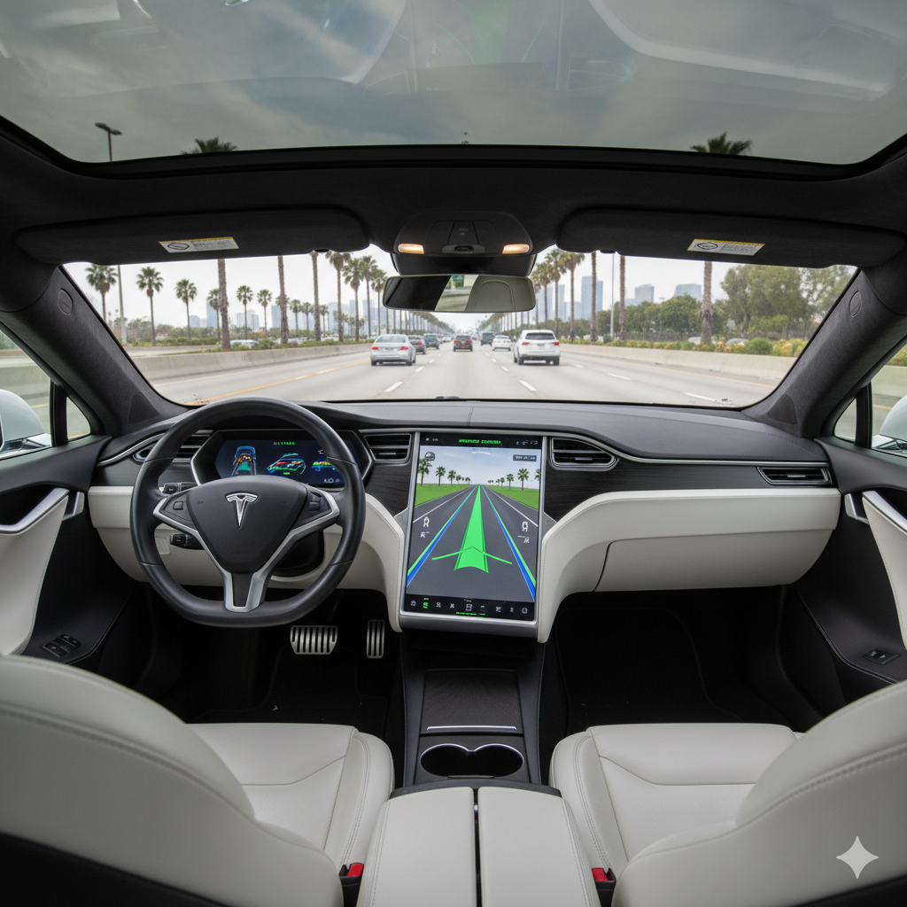

## Episode Summary

# Chaos on I-35

Paul drives a Tesla with FSD to work in Minneapolis. One day, one of the the software updates accidentally came with a bug that left a loophole in the system. Monday, on his way to work, Paul's Tesla gets hacked and the hackers take full control of the car denying him any access whatsoever. They drive him all around Minneapolis to the point where he is late to work. Adding onto that, they jam his signals as well so he can’t reach out for help to the outside world. He is late to a very important meeting with his boss. Finally, when the battery is about to die. They make his car do burnouts in the middle of the road causing multiple accidents and injuries. When he gets out of the car he is traumatized by this experience and decides to sue Tesla saying that he does not really own the car as they had promised to him when he bought it.

*AI generated image*

## Positive News Headline

Tesla Saves Lives: Tesla Car Detects Heart Attack And Drives Itself To Hospital
